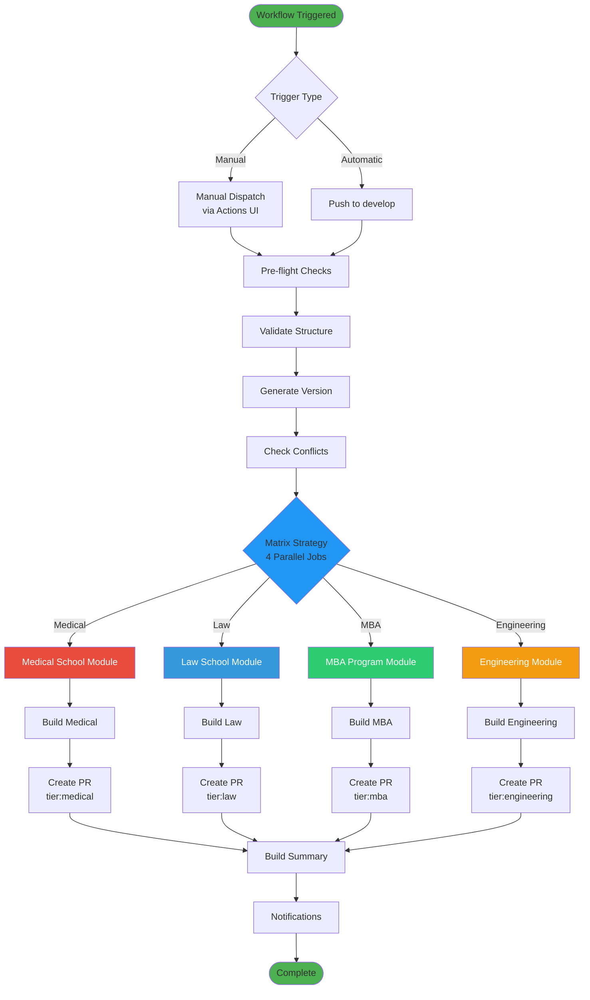
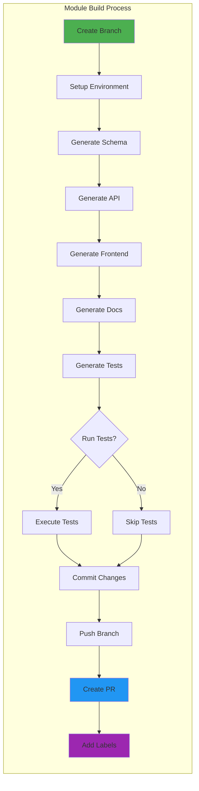
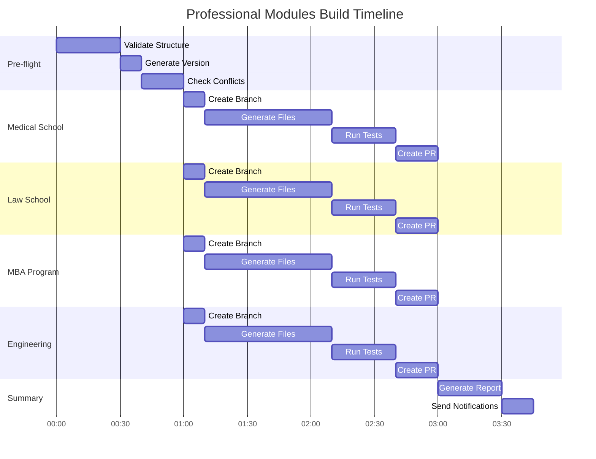
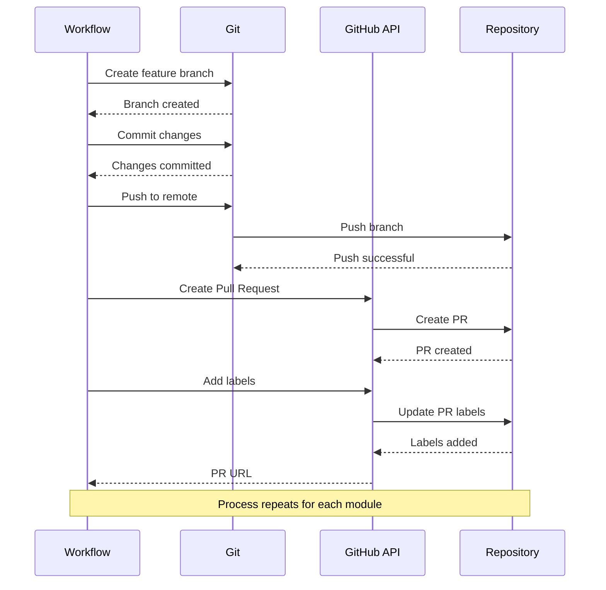
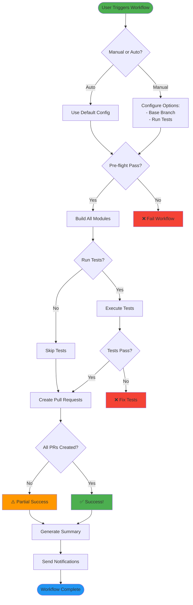
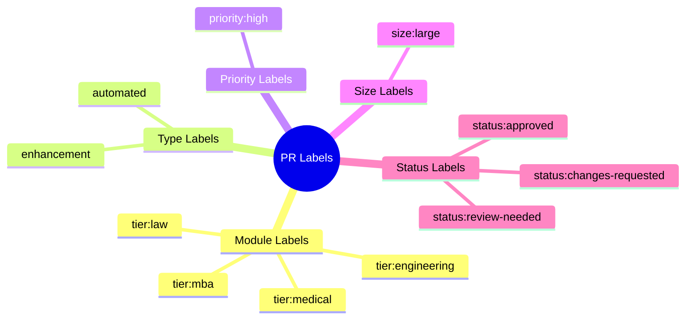
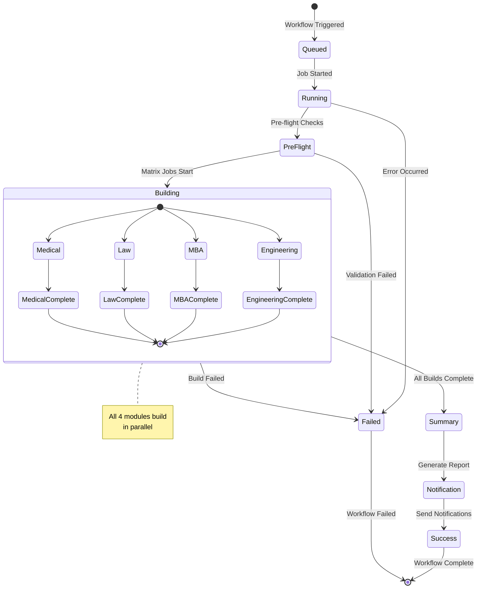
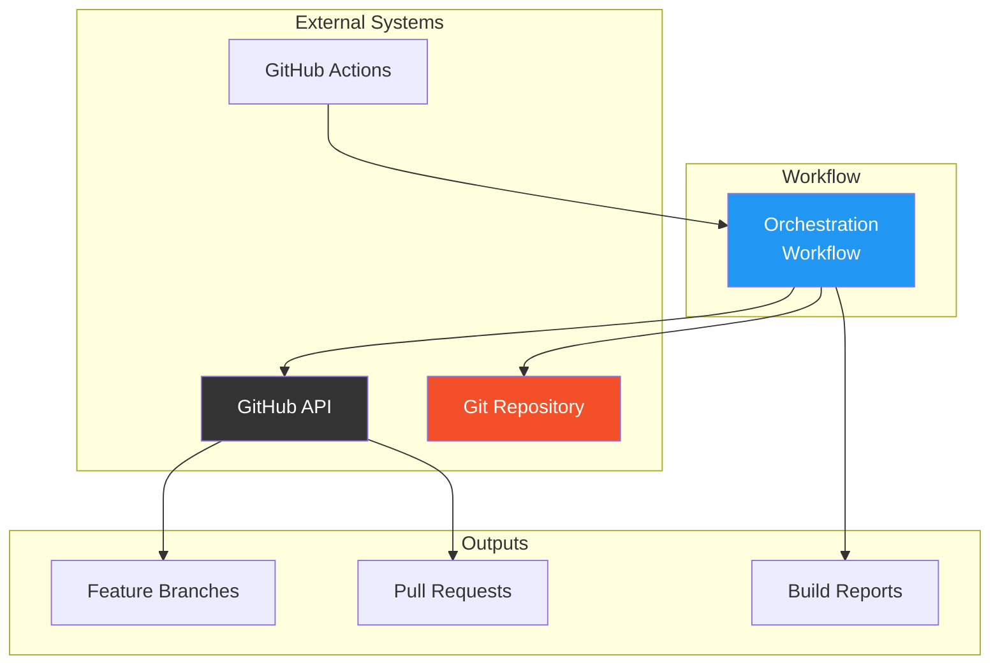

# Professional Modules Workflow - Visual Diagram

## Workflow Architecture

## Detailed Module Build Flow

## Parallel Execution Timeline

## PR Creation Flow

## Module Structure Generation

```mermaid
graph TD
    Root[modules/] --> Med[medical-school/]
    Root --> Law[law-school/]
    Root --> MBA[mba/]
    Root --> Eng[engineering/]
    
    Med --> MedDB[database/<br/>schema.sql]
    Med --> MedAPI[api/<br/>endpoints.py]
    Med --> MedFE[frontend/<br/>Dashboard.tsx]
    Med --> MedDocs[docs/<br/>README.md]
    Med --> MedTests[tests/<br/>test_api.py]
    Med --> MedInfo[BUILD_INFO.txt]
    
    Law --> LawDB[database/<br/>schema.sql]
    Law --> LawAPI[api/<br/>endpoints.py]
    Law --> LawFE[frontend/<br/>Dashboard.tsx]
    Law --> LawDocs[docs/<br/>README.md]
    Law --> LawTests[tests/<br/>test_api.py]
    Law --> LawInfo[BUILD_INFO.txt]
    
    MBA --> MBADB[database/<br/>schema.sql]
    MBA --> MBAAPI[api/<br/>endpoints.py]
    MBA --> MBAFE[frontend/<br/>Dashboard.tsx]
    MBA --> MBADocs[docs/<br/>README.md]
    MBA --> MBATests[tests/<br/>test_api.py]
    MBA --> MBAInfo[BUILD_INFO.txt]
    
    Eng --> EngDB[database/<br/>schema.sql]
    Eng --> EngAPI[api/<br/>endpoints.py]
    Eng --> EngFE[frontend/<br/>Dashboard.tsx]
    Eng --> EngDocs[docs/<br/>README.md]
    Eng --> EngTests[tests/<br/>test_api.py]
    Eng --> EngInfo[BUILD_INFO.txt]
    
    style Root fill:#9E9E9E
    style Med fill:#e74c3c,color:#fff
    style Law fill:#3498db,color:#fff
    style MBA fill:#2ecc71,color:#fff
    style Eng fill:#f39c12,color:#fff
```

## Decision Flow

## Label System

## Workflow States

## Integration Points

---

## How to View These Diagrams

### In GitHub
These Mermaid diagrams will render automatically when viewing this file on GitHub.

### Locally with VS Code
1. Install the "Markdown Preview Mermaid Support" extension
2. Open this file
3. Press `Ctrl+Shift+V` (or `Cmd+Shift+V` on Mac) to preview

### Online
Copy the Mermaid code and paste it into:
- [Mermaid Live Editor](https://mermaid.live/)
- [GitHub Gist](https://gist.github.com/) (will render automatically)

---

**Last Updated**: 2024-10-29  
**Diagram Version**: 1.0.0
