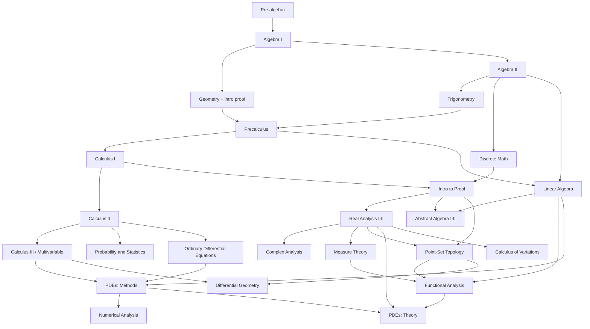

# AXIOM Curriculum and Proof Extension

Companion to AXIOM_Build_Prompt.md. This document extends the platform to cover
the full mathematics ladder from pre-algebra through partial differential
equations and the proof-based advanced core (real analysis, abstract algebra,
topology, complex analysis, functional analysis). It assumes the platform in the
build prompt is complete.

The central design fact: computational math and proof-based math are two
different grading problems. Do not paper over that. The CAS core already handles
the computational side. Proof needs its own machinery, described in Section 4.

---

## 1. Full curriculum scope (tiers)

Each tier lists its domains and the dominant grading mode. CAS means the SymPy
computer-algebra grader from the build prompt. Proof means the tiered proof
strategy in Section 4. Many advanced courses are mixed (compute an answer, then
justify it).

| Tier | Domains | Dominant grading mode |
| --- | --- | --- |
| 0 Foundations | Pre-algebra and arithmetic (integers, fractions, ratio, percent, order of operations) | CAS and numeric |
| 1 Secondary | Algebra I, Geometry (with intro two-column proof), Algebra II, Trigonometry, Precalculus | CAS, numeric, graphing, early scaffolded proof |
| 2 Calculus | Calculus I (limits, derivatives, intro integrals), Calculus II (integration techniques, sequences and series, Taylor), Calculus III (multivariable, vector calculus, Green, Stokes, divergence) | CAS, numeric, graphing |
| 3 Core methods | Linear Algebra, Ordinary Differential Equations, Discrete Mathematics, Probability and Statistics | CAS, numeric, some scaffolded proof (induction, combinatorial arguments) |
| 4 Proof transition | Introduction to Proof and Mathematical Reasoning (logic, quantifiers, direct and contrapositive and contradiction and induction, sets, functions, relations, cardinality) | Proof (this tier is where proof grading is introduced in earnest) |
| 5 Proof core | Real Analysis I and II, Abstract Algebra I and II, Point-Set Topology, Complex Analysis, Number Theory | Proof, with CAS for the computational subparts |
| 6 Advanced and graduate | Partial Differential Equations (methods and theory), Fourier and Functional Analysis, Measure Theory and Lebesgue Integration, Numerical Analysis, Differential Geometry, Calculus of Variations | Mixed: CAS heavy in methods and numerics, Proof heavy in theory |

PDEs deserve a note because they straddle the divide. The methods course
(classification, heat and wave and Laplace equations, separation of variables,
Fourier series and transforms, method of characteristics, Green's functions,
Sturm-Liouville) is largely CAS-gradable. The theory course (weak solutions,
Sobolev spaces, existence and uniqueness, energy estimates) is proof-based and
depends on real analysis and functional analysis. Split PDEs into two knowledge
regions accordingly.

Applied and engineering math track. Given the EE and photonics context, tag a
cross-cutting track through Linear Algebra, ODEs, PDEs, Fourier and Functional
Analysis, Complex Analysis, and Numerical Analysis, so a learner can follow the
applied spine without the full pure-math proof sequence, and vice versa.

---

## 2. Curriculum dependency graph

This is the prerequisite backbone the knowledge graph must encode. Advanced math
lives or dies on prerequisite chains, so enforce them in the adaptive path
planner. Arrows mean "is a prerequisite for."

---

## 3. Two kinds of content, two kinds of skill node

Extend the KnowledgeNode taxonomy with a node kind:

- Computational skill. A procedure with a checkable answer (factor this, solve
  this ODE, compute this line integral, separate variables on this PDE).
- Concept. A definition or theorem to understand and apply.
- Proof technique. A reusable argument pattern tracked as its own skill:
  direct proof, contrapositive, contradiction, induction and strong induction,
  epsilon-delta arguments, proof by cases, existence and uniqueness arguments,
  diagonalization, construction of counterexamples, quotient and isomorphism
  arguments, compactness arguments, and so on.
- Theorem-with-proof. A named result the learner must be able to prove, linked
  to the techniques it uses and the prior results it depends on.

The reason to make proof techniques first-class nodes: a student who can do
epsilon-delta continuity should get credit toward it in real analysis and in
metric-space topology, without re-proving mastery from zero. Mastery of a
technique transfers across content areas. The adaptive engine should model that.

---

## 4. Proof grading strategy (the hard part)

There is no single reliable way to auto-grade a free-form proof, so use four
graders and route each item to the right one by proof type and stakes. Trust
descends from top to bottom.

### 4.1 Formal verification (deterministic, fully trustworthy)

For a formal track, the student writes the proof in a proof assistant language
and a kernel verifies it. If it type-checks, it is correct, with no AI in the
loop and no human judgment needed.

- Primary target: Lean 4 with Mathlib. Rich library, active community, strong
  onboarding material (the Natural Number Game is a proven way to teach the
  language by building arithmetic from scratch). Isabelle or HOL and the Rocq
  Prover (formerly Coq) are acceptable alternate backends behind the same
  interface.
- Run the checker in a sandboxed, resource-limited worker. Never expose the
  build environment to arbitrary input beyond the proof text.
- Provide a structured editor with tactic autocomplete, goal-state display (show
  the current hypotheses and target as the student applies tactics), and a
  library search.
- Use this for the formal-methods track and for any course where rigor matters
  more than expressive freedom. It is the gold standard for grading, but the
  formalization overhead is real, so it is an opt-in track, not the default for
  every proof course.

### 4.2 Structured and scaffolded proof (auto-gradable, limited freedom)

For teaching proof structure, use item types that are checkable without natural
language:

- Proof assembly. Provide the steps of a proof shuffled, the student orders them.
- Justification matching. Each step is given, the student selects the rule or
  prior result that justifies it from a bank.
- Fill-the-gap. A proof with holes, the student supplies the missing line
  (checked by CAS if algebraic, or by exact match against accepted forms).
- Find-the-error. Present a flawed proof, the student identifies the invalid
  step and explains why (the explanation goes to the 4.3 grader if free text).
- Counterexample items. The student supplies an object that breaks a false claim,
  checked by CAS or by evaluating the constructed object against the property.

These carry most of the load in the proof-transition tier (Tier 4) because they
teach the shape of an argument before the student writes prose.

### 4.3 AI-assisted grading with mandatory human sign-off (assist, not verdict)

For free-form proofs written in LaTeX or natural language, the copilot performs a
first pass and the instructor finalizes. Be honest about the limits: current
models both miss real gaps and flag correct steps as wrong, and a confident
wrong proof can fool them. Therefore:

- The AI never issues a final high-stakes grade on its own. It produces a
  provisional score against a rubric, a list of suspected gaps or errors with
  the specific lines, and targeted feedback for the student.
- Every proof above a stakes threshold or below a confidence threshold goes to a
  human-override queue. This matches the platform's existing rule that no
  high-stakes decision is finalized by AI alone.
- Ground the grader with a reference proof and an explicit rubric of required
  milestones per problem, so the model is comparing against a known-good
  argument rather than judging from scratch.
- Present AI output as feedback labeled AI-assisted, never as verification.
  Do not tell a student a natural-language proof is correct on AI judgment alone.

### 4.4 Autoformalization bridge (experimental assist only)

Optionally, attempt to translate an informal proof into Lean and verify it. This
is a research-grade capability and is not reliable enough to grade on. Offer it
as an experimental aid that, when it succeeds, gives the student a strong signal,
and when it fails, means nothing about the proof's correctness. Never let a
failed autoformalization lower a grade.

### 4.5 Routing rule

Route each proof item by its declared type: formal-track items to 4.1, structure
and transition items to 4.2, free-form proofs to 4.3 with human sign-off. The
computational subparts of any item always go to the CAS grader. Store the grader
type and a confidence value on every GradingRecord, as the build prompt already
requires.

---

## 5. New assessment item types to add

Beyond the build prompt's set, add:

- Formal proof (proof-assistant backed, kernel-verified).
- Free-form proof (LaTeX or rich text, AI-assisted plus human grading).
- Proof assembly, justification matching, proof gap-fill, find-the-error.
- Counterexample construction.
- State-the-definition and state-the-theorem (checked against accepted phrasings,
  with an AI similarity pass for near-misses that a human confirms).
- Multi-part mixed items (compute, then prove) that split parts across the CAS
  grader and the proof grader.

---

## 6. Content and pedagogy for proof

Computational lessons keep the existing worked-example and interactive format.
Proof content needs more:

- Annotated proofs. Every step shows not just what but why: the technique in use,
  the hypothesis being invoked, and the goal being reduced. A proof explorer view
  lets the student expand any step to see its justification and collapse it back.
- Proof-strategy lessons. Teach the techniques as skills in their own right
  (how to set up an induction, when to try the contrapositive, how to build a
  counterexample), independent of any single theorem.
- Inquiry mode. Support a Moore-method style where the student is given
  definitions and asked to prove results with graduated hints rather than being
  shown the proof first. The copilot acts as a Socratic guide here.
- Definition and theorem reference. A per-course, per-tenant library of
  definitions and named theorems that items and the copilot retrieve from, so
  everything stays consistent with the course's chosen conventions.

---

## 7. Copilot changes for proof

The copilot gains a proof tutor mode, grounded in EUREKA's reasoning core and the
course's definition and theorem library:

- Socratic hints that never hand over the proof. Graduated: first a nudge toward
  the right technique, then the first step, then more, matching the platform's
  existing graduated-hint rule.
- Gap detection on a student draft, pointing at the specific line where the
  argument breaks, without asserting the whole proof is correct.
- Practice generation. Generate provable statements at a target difficulty with a
  known reference proof, so the 4.3 grader has ground truth. Every generated
  statement and its reference proof are verified (by the formal checker where the
  statement is formalizable, or by human review) before entering a bank.
- Counterexample search to help authors validate that a false statement really
  is false before it becomes a find-the-error or counterexample item.

Keep all of this behind the copilot interface so EUREKA reasoning is the primary
backend and a direct model call is the fallback.

---

## 8. Mastery model changes

- Track proof techniques as their own MasteryState nodes, updated whenever a
  proof using that technique is graded, so competence transfers across courses.
- For proof-based courses, separate two mastery signals per theorem node: can
  apply the result, and can prove the result. They are different skills and a
  learner can have one without the other.
- Weight evidence by grader trust. A formally verified proof is stronger evidence
  than an AI-assisted provisional pass. Store the grader confidence and let the
  mastery estimator use it.
- The adaptive path planner must respect the long prerequisite chains from
  Section 2. Do not route a learner into real analysis proofs before the
  proof-transition techniques show mastery.

---

## 9. Phasing this scope in

Add these as content and capability waves on top of the platform phases in the
build prompt. Do not attempt Tier 5 and 6 proof grading until the CAS-graded
tiers are solid.

- Wave A. Tiers 0 through 3 (pre-algebra through calculus, linear algebra, ODEs,
  discrete, probability). Pure CAS, numeric, and graphing. This is the largest
  audience and the lowest grading risk. Ship it first and get it right.
- Wave B. Tier 4 proof transition using only the structured and scaffolded
  graders from 4.2. No free-form AI grading yet. This teaches proof structure
  safely and auto-gradably.
- Wave C. Formal track (4.1) with Lean 4 and Mathlib, starting with a Natural
  Number Game style onboarding, then a formal real-analysis or number-theory
  unit. Deterministic grading, opt-in.
- Wave D. Free-form proof grading (4.3) with mandatory human sign-off, rolled out
  to Tier 5 courses one at a time (real analysis first, then abstract algebra,
  then topology and complex analysis).
- Wave E. Tier 6 (PDE theory, functional analysis, measure theory, and the rest),
  which depends on Waves C and D being stable.

Honest calibration. Wave A is a large but well-understood build. Waves C and D
are research-adjacent. Formal verification integration is real engineering effort
but gives trustworthy grades. Free-form AI proof grading will never be fully
autonomous at the rigor these courses demand, so budget for human graders in the
loop for Tier 5 and 6, and present that as a feature (expert review), not a
failure. A platform that claims to auto-grade graduate analysis proofs with no
human is overpromising, and sophisticated users will catch it immediately.

---

## 10. Acceptance criteria additions

- A formal-track item written in Lean 4 is accepted only when the kernel
  verifies it, and a deliberately broken proof is rejected, both proven by tests.
- A proof-assembly item grades a correct ordering as full credit and a wrong
  ordering as partial or zero, deterministically.
- A free-form proof runs the AI first pass, produces line-level gap feedback, and
  lands in the human-override queue whenever confidence or stakes cross the
  threshold. It is never auto-finalized above that threshold.
- A proof technique's MasteryState increases after a graded proof that uses it,
  in a different course than where it was first learned, demonstrating transfer.
- The path planner refuses to route a learner into a Tier 5 proof course until
  the Tier 4 proof-transition techniques meet the mastery threshold.
- A mixed compute-then-prove item splits grading: the computed part to CAS, the
  proof part to the proof grader, with both recorded on the attempt.
